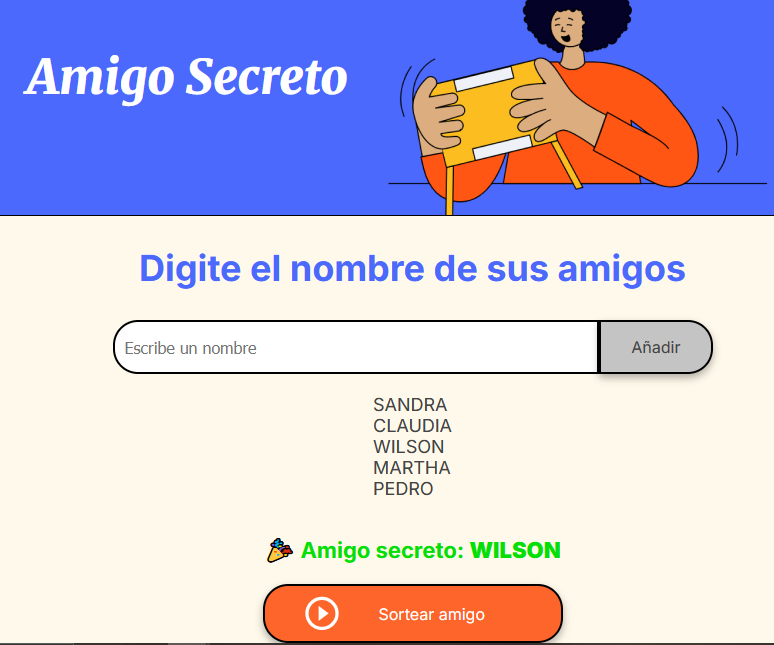

# 🎁 Amigo Secreto

**Amigo Secreto** es una aplicación web ligera e interactiva que permite realizar sorteos aleatorios entre una lista de participantes para revelar quién es el "amigo secreto". Perfecta para celebraciones navideñas, dinámicas de equipo o reuniones familiares.

---

## 🧩 Descripción

La aplicación permite a los usuarios ingresar nombres en una lista y realizar un sorteo aleatorio para asignar un amigo secreto. Funciona completamente del lado del cliente (sin base de datos), garantizando rapidez, privacidad y facilidad de uso.

---

## 📸 Capturas de pantalla

> ⚠️ Estas son imágenes de referencia.

---

## 🚀 Uso

1. Ingresa un nombre en el campo de texto.
2. Haz clic en el botón **Adicionar**.
3. Verás el nombre reflejado inmediatamente en la lista.
4. Repite el proceso con todos los participantes.
5. Presiona el botón **Sortear Amigo** para obtener un nombre al azar.

🔔 Si el campo está vacío, se mostrará una alerta indicando que se debe ingresar un nombre válido.

---

## 🎯 Funcionalidades

- ➕ **Agregar nombres**  
  Los usuarios pueden añadir participantes a través de un campo de texto y botón.

- ✅ **Validación de entradas**  
  Se impide el ingreso de campos vacíos mediante alertas visuales.

- 👀 **Visualización en tiempo real**  
  Los nombres ingresados se muestran inmediatamente en la lista.

- 🎲 **Sorteo aleatorio**  
  Al presionar “Sortear Amigo”, se selecciona un nombre al azar.

---

## 🧰 Tecnologías utilizadas

- **HTML5** – Para la estructura semántica del sitio.
- **CSS3** – Para el diseño visual de la interfaz.
- **JavaScript (Vanilla JS)** – Para la lógica de interacción, validación y sorteo.

---

## 🤝 Contribuciones

¿Quieres colaborar en este proyecto? ¡Eres bienvenido!

Pasos para contribuir:

1. Realiza un **fork** del repositorio.
2. Crea una rama: `git checkout -b feature/mi-nueva-funcionalidad`.
3. Realiza tus cambios y haz commit: `git commit -m "Agrega nueva funcionalidad"`.
4. Haz push a la rama: `git push origin feature/mi-nueva-funcionalidad`.
5. Abre un **Pull Request** explicando tu aporte.

📌 Por favor, mantén el código limpio y sigue una estructura clara.

---

## 📄 Licencia

Este proyecto **no cuenta con una licencia formal**.  
Fue creado exclusivamente con fines educativos y puede ser reutilizado libremente para estudios, prácticas personales o demostraciones.

---

¿Te gustó este proyecto? ¡Dale una ⭐ y compártelo con quien lo necesite! 🙌
